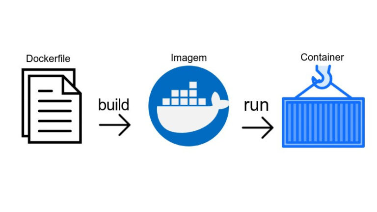
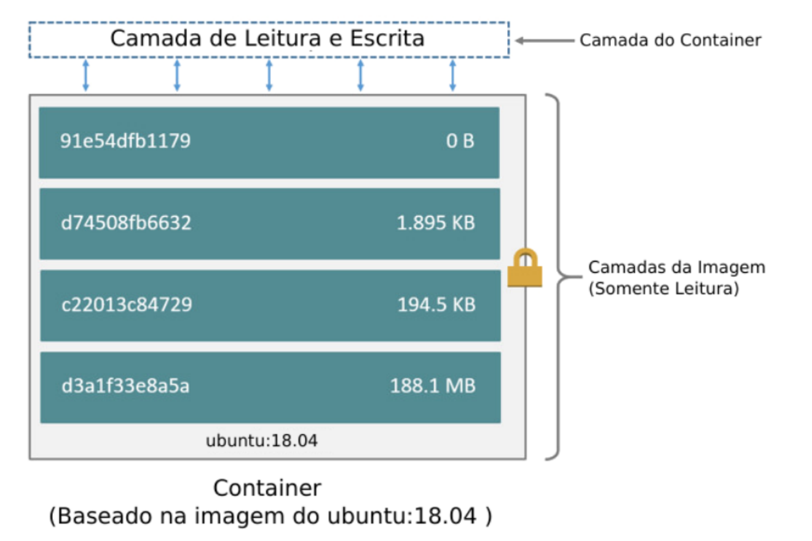

## Introdução

Docker é um conjunto de produtos de plataforma como serviço que usam virtualização de nível de sistema operacional para entregar software em pacotes chamados contêineres. Os contêineres são isolados uns dos outros e agrupam seus próprios softwares, bibliotecas e arquivos de configuração.

Um pouco mais a fundo, podemos dizer que containeres são duas coisas, como um programa normal do Linux, os contêineres têm dois estados, repouso e execução.

Quando em repouso, um contêiner é um arquivo (ou conjunto de arquivos) que é salvo no disco. Isso é conhecido como Container Image ou Container Repository. 

Quando você digita o comando para iniciar um contêiner, o Container Engine (docker, podman, containerd, lxc, rkt) descompacta os arquivos e metadados necessários e os entrega ao kernel do Linux. Iniciar um contêiner é muito semelhante a iniciar um processo normal do Linux e requer fazer uma chamada de API para o kernel do Linux. Essa chamada de API normalmente inicia um isolamento extra e monta uma cópia dos arquivos que estavam na imagem do contêiner. Uma vez em execução, os contêineres são apenas um processo Linux.

## Projeto containerizando

1. gerar pacote containerizando no [start spring](https://start.spring.io/) com as dependências:

* jpa
* postgres
* web
* actuator

2. fazer o download do zip 

3. unzip pacote

```bash
unzip containerizando.zip
```

4. configurar application.properties para o postgres e para o actuator:

```xml
spring.jpa.database=POSTGRESQL
spring.datasource.platform=postgres
spring.database.driverClassName=org.postgresql.Driver
spring.datasource.username=postgres
spring.datasource.password=password
spring.datasource.url=jdbc:postgresql://localhost:5432/db
management.endpoints.health.sensitive=false
management.health.db.enabled=true
management.health.defaults.enabled=true
management.endpoint.health.show-details=always
```

5. configurar pom para actuator:

```xml
		<dependency>
			<groupId>org.springframework.boot</groupId>
				  <artifactId>spring-boot-starter-actuator</artifactId>
		  </dependency>
```

## Docker compose 

Ferramenta para definir e executar multiplos containers de forma declarativa, utilizando arquivos no formato yaml

6. Crie e execute este compose para subir o banco de dados, necessário para o corrreto startup de nossa aplicação:

docker-compose:

```yaml
version: '3'
services:

    postgres:
        image: 'postgres:alpine'
        volumes:
          - postgres-volume:/var/lib/postgresql/data
        ports:
          - 5432:5432
        environment:
          POSTGRES_USER: postgres
          POSTGRES_PASSWORD: password
          POSTGRES_DB: db
          POSTGRES_HOST: postgres    
volumes:
  postgres-volume:
```

start compose:

```bash
docker-compose up -d
```

7. build:

```bash
./mvnw package
```

O build foi feito com sucesso? Retornou algum erro de conexão com o banco de dados?

8. executando a app

```bash
mvn spring-boot:run
```

O start foi feito com sucesso? Retornou algum erro de conexão com o banco de dados?

Acesso em: http://localhost:8080/actuator/health

## Dockerfile

O Dockerfile nada mais é do que um meio que utilizamos para criar nossas próprias imagens. Em outras palavras, ele serve como a receita para construir um container.

# Imagem x Container

Uma imagem nada mais é do que uma representação imutável de como será efetivamente construído um container. Por conta disso, nós não rodamos ou inicializamos imagens, nós fazemos isso com os containers.

O ponto que temos que entender agora é o seguinte: escrevemos um Dockerfile, construímos uma imagem a partir dele executando o comando docker build, e, por fim, criamos e rodamos o container com o comando docker run. O container é o fim enquanto a imagem é o meio.



9. crie este Dockerfile para a aplicação:

```Dockerfile
FROM openjdk:11.0.7-jre-slim-buster

ARG JAR_FILE=target/*.jar
COPY ${JAR_FILE} application.jar
ENTRYPOINT ["java", "-jar", "/application.jar"]
```

10. build

```bash
docker image build -t rmnobarra/containerizando:latest .
```

11. executando o container:

```bash
docker container run -p 8080:8080 rmnobarra/containerizando --name containerizando
```

Verificar o status do serviço em http://localhost:8080/actuator/health

Por quê a conexão com o banco não está mais funcionando?

O contexto de conexão agora mudou, durante o desenvolvimento, o build / start da aplicação conectava no localhost da estação
que executava a ação, agora, dentro do container, o localhost não tem nenhum banco de dados aguardando conexão, logo é necessário
alterar a string de conexão, permitindo que o container da aplicação fale com o container do banco de dados

13. Alterar a string de conexão no application.properties, tornando-a flexivel tanto em desenvolvimento quanto em execução, utilizando
variáveis de ambiente

De:

```xml
spring.datasource.url=jdbc:postgresql://localhost:5432/db
```

para:

```xml
spring.datasource.url=${DATABASE_URL:jdbc:postgresql://localhost:5432/db}
```

14. Adicionar o containerizando no docker compose:

```Dockerfile
version: '3'
services:

    containerizando:
        container_name: containerizando
        image: rmnobarra/containerizando
        environment:
          DATABASE_URL: "jdbc:postgresql://postgres:5432/db"
        depends_on:
          - "postgres"
        ports:
          - 8080:8080    

    postgres:
        container_name: postgres
        image: 'postgres:alpine'
        volumes:
          - postgres-volume:/var/lib/postgresql/data
        ports:
          - 5432:5432
        environment:
          POSTGRES_USER: postgres
          POSTGRES_PASSWORD: password
          POSTGRES_DB: db
              
volumes:
 postgres-volume:
```

15. validar o compose com

docker-compose config

16. iniciar o container do containerizando:

```bash
docker-compose up -d 
```

Verifique novamente o status do serviço em http://localhost:8080/actuator/health

Por quê a conexão com o banco de dados ainda não funciona?

Não basta somente alterar a string de conexão, é necessário buildar a aplicação novamente, assim como gerar uma nova imagem docker.
Porque o build da imagem reflete o seu estado naquele momento, cada alteração na aplicação, demanda um novo build de imagem

```bash
./mvnw package
```

```bash
docker image build -t rmnobarra/containerizando:latest .
```

docker-compose down && docker-compose up

É possível iniciar ou derrubar determinado container dentro de um docker-compose utilizando o service name. Útil quando se tem diversos
serviços rodando no mesmo compose

E por quê funcionou agora?

Quando falamos de comunicação entre containers, basicamente temos 2 redes para conexão, a host network, que seria a rede aonde o serviço 
docker está sendo executado e temos a container network, que é uma rede dedicada para comunicação entre containers. É possivel
criar N redes para organizar a comunicação, quando nenhuma rede é criada, por padrão os containers são conectados a rede "_default"

Em cada container network o docker cria um serviço dns para facilitar a comunicação entre os containers, e com isso é possível a 
conexão entre containers utilizando o service name.

Veja a string de conexão da aplicação com o comando:

```bash
docker exec -ti containerizando env
```

Nenhum dado adicional além do service name do postgres foi utilizado e o actuator mostra que a conectividade entre aplicação e banco de dados
está ok. Verifique novamente em: http://localhost:8080/actuator/health

E como essa comunicação ocorre?

Basicamente temos 2 tipos de redes, a container network e host network. Quando falamos de conectividade entre containers, a comunicação é feita diretamente via a container network.

Quando queremos acessar externamente determinado serviço que está sendo executado em um container, utilizamos a host network e um mapeamento de portas (parâmetro -p)

Esse mapeamento nada mais é do que regras de firewall utilizando o módulo do kernel linux, netfilter

O netfilter é um módulo que fornece ao sistema operacional Linux as funções de firewall, NAT e log dos dados que trafegam por rede de computadores. Geralmente manipulamos as regras de firewall utilizando iptables ou nftables que são basicamente a interface amigável
para a gerencia das regras

Alguns comandos para listar as regras de firewall:

```bash
sudo iptables -S
```

```bash
sudo iptables -t nat -L
```

Veja o ip nas regras para o banco de dados (porta 5432) e para a aplicação (8080), redireciona automáticamente para os respectivos containers, veja seus ips:

Aplicação:
```bash
docker inspect containerizando -f '{{range.NetworkSettings.Networks}}{{.IPAddress}}{{end}}'
```

Banco de dados:
```bash
docker inspect postgres -f '{{range.NetworkSettings.Networks}}{{.IPAddress}}{{end}}'
```
### Docker Image

Uma imagem Docker é um pacote executável que inclui tudo o que é necessário para executar um aplicativo, incluindo o código, bibliotecas, variáveis de ambientes e arquivos de configuração.

As imagens do Docker possuem camadas intermediárias que aumentam a capacidade de reutilização, diminuem o uso do disco e aceleram a construção do docker, permitindo que cada etapa seja armazenada em cache. Essas camadas intermediárias não são mostradas por padrão.



Um ponto interessante é que em um cenário onde temos 1 container com a imagem ubuntu:18.04 por exemplo, ocuparia 200MB ( estamos considerando este tamanho para a imagem citada) somados a quantidade de dados específicos deste container ( vamos considerar 50MB para este exemplo) totalizando 250MB. o mesmo caso com 10 containers serão utilizados os 200MB da imagem somados aos 50MB de cada container em execução, pois suas camadas readonly é compartilhada, totalizando assim 750MB no total.

[Fonte: Docker do básico à certificação docker dca](https://leanpub.com/dockerdca)

## Analizando a imagem utilizando o dive

O [dive](https://github.com/wagoodman/dive) é uma ferramenta para explorar uma imagem docker, conteúdo de camada e descobrir maneiras de reduzir o tamanho de sua imagem Docker / OCI. (open container iniciative)

Executando:

17. pull da imagem

```bash
docker pull wagoodman/dive
```

18. Modo interativo: 

```bash
docker run --rm -it \
    -v /var/run/docker.sock:/var/run/docker.sock \
    wagoodman/dive:latest rmnobarra/containerizando:latest
```

Passando o parâmetro --ci, não é retornado a ui interativa, lowestEfficiency=0.8 faz o teste falhar caso a eficiência da imagem
fique abaixo de 80% e o espaço desperdiçado for maior que 45%

19. Modo ci:

```bash
docker run --rm -it \
    -v /var/run/docker.sock:/var/run/docker.sock \
    wagoodman/dive:latest --ci rmnobarra/containerizando:latest \
    --lowestEfficiency=0.8 --highestUserWastedPercent=0.45
```

O objetivo dessa ferramenta é tornar as imagens Docker ou OCI mais eficientes, alguns aspectos para ter em mente durante a construção:


* Copy-on-write

Copy-on-write é uma estratégia de compartilhamento e cópia de arquivos para máxima eficiência. Se um arquivo ou diretório existir em uma camada inferior da imagem e outra camada (incluindo a camada gravável) precisar de acesso de leitura a ele, ele apenas usará o arquivo existente. Na primeira vez que outra camada precisa modificar o arquivo (ao construir a imagem ou ao executar o contêiner), o arquivo é copiado para essa camada e modificado. Isso minimiza a E / S e o tamanho de cada uma das camadas subsequentes.

Este Dockerfile é um ótimo exemplo de como não criar uma imagem:

```Dockerfile
# Start with Ubuntu Trusty
FROM  phusion/baseimage:0.10.0

# Use baseimage-docker's init system.
CMD   ["/sbin/my_init"]

RUN	apt-get update
RUN apt-get -y install wget
RUN apt-get -y install curl
RUN curl -sL https://deb.nodesource.com/setup_10.x | bash
RUN apt-get -y install nodejs git-core
RUN npm install pm2 -g --no-optional
RUN npm install yarn@1.9.4 -g

# Clean up APT when done.
RUN apt-get clean && rm -rf /var/lib/apt/lists/* /tmp/* /var/tmp/*

# Copy source files to container
COPY	. /var/www/node

# Change owner to non-root node user and set up permissions
RUN chmod -R 777 var/www/node /var/log/
RUN useradd -m node && mkdir /var/log/nodejs && chown -R node:node /var/www/node /var/log/

# Install all my packages and build
RUN	cd /var/www/node && /sbin/setuser node yarn install && /sbin/setuser node yarn build:tsoa

# Open local port 3000
EXPOSE	3030

# Run PM2 as a daemon managed by runit
RUN mkdir /etc/service/pm2 && chmod -R 777 /etc/service/pm2
ADD ./scripts/pm2.sh /etc/service/pm2/run
RUN chmod -R 777 /etc/service/pm2
```

* Multi-stage build: método de organizar um Dockerfile para minimizar o tamanho do contêiner final, melhorar o desempenho do tempo de execução, permitir uma melhor organização de comandos e arquivos do Docker e fornecer um método padronizado de execução de ações de compilação

Dockerfile após ajustes:

```Dockerfile
# Start with Ubuntu Trusty
FROM  phusion/baseimage:0.10.0 AS BuildImage

# Use baseimage-docker's init system.
CMD   ["/sbin/my_init"]

RUN	apt-get update && apt-get install -y \
    wget \
    curl \
    && curl -sL https://deb.nodesource.com/setup_10.x | bash \
    && apt-get install -y \
    nodejs \
    git-core \
    && npm install yarn@1.9.4 -g

# Clean up APT when done.
RUN apt-get clean \
    && rm -rf /var/lib/apt/lists/* /tmp/* /var/tmp/*

# Copy source files to container
COPY	. /var/www/node

# Install all my packages and build
RUN	cd /var/www/node \
    && yarn install \
    && yarn build:tsoa \
    && yarn cache clean

FROM  phusion/baseimage:0.10.0 as RunImage

# Use baseimage-docker's init system.
CMD   ["/sbin/my_init"]

RUN curl -sL https://deb.nodesource.com/setup_10.x | bash \
    && apt-get update && apt-get install -y nodejs \
    && npm install pm2 -g --no-optional

COPY --from=BuildImage /var/www/node /var/www/node

# Clean up APT when done.
RUN apt-get clean \
    && rm -rf /var/lib/apt/lists/* /tmp/* /var/tmp/*

# Change owner to non-root node user and set up permissions
RUN chmod -R 777 var/www/node /var/log/ \
    && useradd -m node \
    && mkdir /var/log/nodejs \
    && chown -R node:node /var/www/node /var/log/

# Open local port 3000
EXPOSE	3030

# Run PM2 as a daemon managed by runit
RUN mkdir /etc/service/pm2 \
    && chmod -R 777 /etc/service/pm2
ADD ./scripts/pm2.sh /etc/service/pm2/run
RUN chmod -R 777 /etc/service/pm2
```

## Docker push

Com uma imagem eficiente e executando a aplicação corretamente, o próximo passo lógico e disponibiliza-la para execução além da estação
de trabalho na qual ela foi gerada, para isso hospedamos essa imagem no que chamamos de container registry.

Existe N containers registries na internet, privados ou públicos. Um dos mais populares é o docker hub.


20. docker login:

```bash
docker login
```

Este processo armazena as crendeciais dentro do .docker no home do usuario que executou o comando.

21. docker push
```bash
docker push rmnobarra/containerizando
```

Agora a imagem com a aplicação está disponivel para qualquer um que tenha acesso a internet.

## Containerizando e Kubernetes

Temos uma imagem de container funcional e pronta para ser utilizada através de algum software que executa containeres.

Para isso precisamos melhorar algumas coisas:

* buildar o projeto para gerar novas versões de nosso container a medida que novas funcionalidades são implementadas.

* Cada release deve ir para um repositório de containeres.

* Organizar e proteger variáveis de ambiente.

* Executar o container.

Kubernetes

[Kubernetes](https://kubernetes.io/), também conhecido como K8s, é um sistema de código aberto para automatizar a implantação, escalonamento e gerenciamento de aplicativos em contêineres.

No momento, o que precisamos saber é que Kubernetes orquestra containeres muito, muito bem. E como faço para executar meu container
em um cluster k8s?

Para interagir com o cluster kubernetes, utilizamos o seu client, o [kubectl](https://kubernetes.io/docs/reference/kubectl/overview/)

e temos 2 formas de interação:

* imperativa

* declarativa

[Aqui](https://kubernetes.io/docs/concepts/overview/working-with-objects/object-management/) tem uma boa doc sobre.

Resumindo, 

Imperativa = executar os comandos "on the fly"

Declarativa = Executar os comandos utilizando arquivos

E no nosso caso, como eu executo o container dentro do cluster.

A forma imperativa seria:

```bash
kubectl run containerizando --image rmnobarra/containerizando:latest
```

A aplicação containerizando precisa de um banco de dados para funcionar. No docker-compose, utilizamos variável de ambiente
para enviar a uri, usuário e senha do banco. O kubernetes também tem :)

Configmap

kubectl create configmap containerizando-cm --from-literal=DATABASE_USER=usuario --from-literal=DATABASE_PASS=senha --from-literal=DATABASE_URL=uri-do-postgres

Opa, temos uma senha em texto plano aqui. Isso não é bom. Por sorte o kubernetes também endereça variáveis de ambiente
com um teor sensivel, Não é uma perfeição mas pelo menos não está em texto puro. 

Secrets

```bash
kubectl create secret generic containerizando-secrets --from-literal=DATABASE_PASS='minhasenha'
```

Decoding a secret

```bash
kubectl get secret containerizando-secrets -o jsonpath='{.data}' | jq '.[]' |  xargs | base64 --decode
```

A forma declarativa seria:


Fazendo encode do base64

echo 'minhasenha' | base64

```yaml

apiVersion: v1
kind: Secret
metadata:
  name: containerizando-secrets
type: Opaque
data:
  DATABASE_PASS: bWluaGFzZW5oYQo=

---

apiVersion: v1
kind: ConfigMap
metadata:
  name: containerizando-cm
  namespace: default
data:
  DATABASE_USER: usuario
  DATABASE_URL: jdbc:postgres:5432/meubanco

---

apiVersion: apps/v1
kind: Deployment
metadata:
  name: containerizando-deployment
  labels:
    app: containerizando
spec:
  replicas: 3
  selector:
    matchLabels:
      app: containerizando
  template:
    metadata:
      labels:
        app: containerizando
    spec:
      containers:
      - name: containerizando
        image: rmnobarra/containerizando:latest
        ports:
        - containerPort: 8080
        envFrom:
        - secretRef:
            name: containerizando-secrets
        - configMapRef:
            name: containerizando-cm
```

Melhorou um pouco a organização e deployment, certo? O ponto é que compartilhar, atualizar e gerenciar yamls dessa forma,
pode não ser a melhor opção. Um ferramenta graduada na cncf e largamente utiliza que se chama Helm, tenta
endereçar essa situação.

Para isso vamos construir um [helm](https://helm.sh/) chart.

Os pormenores da instalação eu sugiro que verifique na documentação, para criar o chart do projeto containerizando, devemos seguir os passos:

1. Cria o diretótio para acomodar o chart

```bash
mkdir pipeline
```

2.Cria helm

```bash
helm create pipeline/containerizando
```

3. Cria configmap.yaml

```bash
touch pipeline/containerizando/templates/configmap.yaml
```

4. Adicione o conteúdo

```yaml
kind: ConfigMap
apiVersion: v1
metadata:
  name: containerizando-cm
data:
  DATABASE_USER: "{{ .Values.application.DATABASE_USER }}"
  DATABASE_URL: "{{ .Values.application.DATABASE_URL }}"
```

5. Cria secrets.yaml

```bash
touch pipeline/containerizando/templates/secrets.yaml
```

6. Adicione o conteúdo
```yaml
---
apiVersion: v1
kind: Secret
metadata:
  name: containerizando-secrets
type: Opaque
data:
  DATABASE_PASS: {{ .Values.application.DATABASE_PASS | b64enc | quote  }}
```

7. No values.yaml altere o type em service de ClusterIP para LoadBalancer:

```yaml
service:
  type: LoadBalancer
  port: 80
```
8. Ainda em values.yaml, adicione as linhas no final do arquivo:

```yaml
application:
  DATABASE_USER: meuusuario
  DATABASE_URL: jdbc:postgresql://xxx.url.com:5432/meubanco
  DATABASE_PASS: minhasenhasupersecreta
```

OBS: Não se preocupe, essas linhas servirão para que o lint do helm não quebre, iremos lidar com senhas
utilizando variáveis de ambiente. ;)

9. No arquivo deployment.yaml, sessão "containers"

```yaml
          envFrom:
            - configMapRef:
                name: containerizando-cm
            - secretRef:
                name: containerizando-secrets
```
e altere a container port para 8080

10. Em services.yaml altere a targetPort para 8080

```yaml

      targetPort: 8080
```

11. Ainda no deployment.yaml, adicione o path do health check (/actuator/health) como abaixo:

```yaml
          livenessProbe:
            httpGet:
              path: /actuator/health
              port: http
          readinessProbe:
            httpGet:
              path: /actuator/health
```

Nesse momento a ideia é que tenhamos um helm chart funcional.


[helmfile](https://github.com/roboll/helmfile)

O helmfile é uma forma declarativa de executar helm charts com bastante funcionalidades bem úteis:

* workspaces
* variáveis de ambiente
* sync

Vale a pena dar uma olhada no projeto ;)

Vamos configurar o helmfile para trabalhar com o nosso chart e também integrando o com o nosso projeto no codebuild

1. cria helmfile.yaml

```bash
touch pipeline/helmfile.yaml
```

2. Adicione o conteúdo

```yaml
helmDefaults:
  tillerless: true
  verify: false
  wait: true
  timeout: 600
  force: true
  
helmBinary: /usr/local/sbin/helm

releases:
  - name: containerizando
    chart: ./containerizando
    namespace: default
    values:
    - ./containerizando/values.yaml
    set:
    - name: application.DATABASE_USER
      value: {{ requiredEnv "DB_USER" }}
    - name: application.DATABASE_URL
      value: {{ requiredEnv "DB_URL" }}
    - name: application.DATABASE_PASS
      value: {{ requiredEnv "DB_PASS" }}
    - name: image.repository
      value: {{ requiredEnv "IMAGE_URL" }}
```

Com isso temos o helmfile configurado e apto a dar play em nosso chart. Vamos para o prox passo que é integrar esses recursos

Buildspec para o codebuild

Estrutura para o buildspec

1. Crie o arquivo buildspec.yaml

```bash
touch pipeline/containerizando/buildspec.yaml
```

2. Adicione o conteúdo

```yaml
version: 0.2

phases:
  install:
    commands:
      - curl -o /bin/kubectl https://storage.googleapis.com/kubernetes-release/release/v1.16.0/bin/linux/amd64/kubectl
      - curl -sS -o aws-iam-authenticator https://amazon-eks.s3-us-west-2.amazonaws.com/1.10.3/2018-07-26/bin/linux/amd64/aws-iam-authenticator
      - wget -qO- https://get.helm.sh/helm-v3.5.2-linux-amd64.tar.gz | tar xvz
      - wget https://github.com/roboll/helmfile/releases/download/v0.141.0/helmfile_linux_amd64
      - mv linux-amd64/helm /usr/local/sbin/helm
      - mv helmfile_linux_amd64 /bin/helmfile
      - chmod +x /bin/kubectl /usr/local/sbin/helm ./aws-iam-authenticator /bin/helmfile
      - export PATH=$PWD/:$PATH
      - helm plugin install https://github.com/databus23/helm-diff
      - apt-get update && apt-get -y install jq python3-pip python3-dev && pip3 install --upgrade awscli
      
  build:
    commands:
      - ./mvnw package
      - docker login --username $DOCKERHUB_USERNAME --password $DOCKERHUB_TOKEN
      - docker build -t containerizando .
      - docker tag containerizando:latest $IMAGE_URL:$IMAGE_TAG

  post_build:
    commands:
      - docker login -u AWS -p $(aws ecr-public get-login-password --region $AWS_REGION) $IMAGE_URL
      - docker push $IMAGE_URL:$IMAGE_TAG
      - helm lint pipeline/containerizando --values pipeline/containerizando/values.yaml
      - aws eks update-kubeconfig --name $CLUSTER_NAME --role-arn $ARN_ROLE
      - cd pipeline && /bin/helmfile apply

```

Cada fase é responsável por uma etapa que faríamos manualmente em nossa máquina, caso quiséssemos buildar nosso projeto
e executa-lo em um cluster eks

Fase install:

Baixa todos os binários necessários, move-os e configura permissão para suas execuções e por fim atualiza o runtime

Fase build:

Autentica no docker hub para não ter limitação de pull, compila o projeto, faz build e tag na imagem de container

Fase post_build:

Autentica no ecr, faz o push da imagem, executa um lint básico no helm chart, faz autenticação no cluster eks e aplica
o helm chart usando o helmfile.

Juntando tudo e deployando a app

Dentro de /infra existe um projeto [terraform](terraform.io) que tenta criar e configurar a maioria das coisas para automatizar esse processo.

Há uma tentativa de aplicar infraestrutura como código aqui. Deixo abaixo algumas linhas sobre para balizar o conceito neste momento:

A infraestrutura como código (IaC) envolve a substituição de processos manuais e procedimentos operacionais padrão para configurar dispositivos e sistemas operacionais de hardware distintos por código ou aplicativo que gerencie e provisione automaticamente a pilha de tecnologia.

Já terraform é uma ferramenta para construção, manutenção e versionamento de infraestrutura de forma segura e eficiente. O Terraform pode gerenciar tanto provedores públicos quanto privados.

O projeto consiste em:

Criar uma instância rds postgres;

Criar uma database no rds;

Criar um cluster eks;

Criar um repositório público no ecr;

Criar as permissões necessárias para o acesso entre serviços;

Criar um projeto no codebuild intimamente ligado a nossa aplicação

OBS: Atente-se ao arquivo terraform.tfvars_sample, ele é mandatório para a execução bem sucedida. [Aqui](https://www.terraform.io/docs/language/values/variables.html#variable-definitions-tfvars-files) tem uma ajuda bem boa
para se situar sobre variáveis e terraform

OBS 2: É preciso "patchear" uma role no config-auth do cluster, para isso:

1. Estar logado na cli da aws

2. Autenticar no cluster

```bash
aws eks --region us-east-1 update-kubeconfig --name containerizando
```

Acesse o diretório que contém o script

```bash
cd /infra/utils
```

3. No script "script.sh", ajuste a variável ACCOUNT_ID conforme o ambiente.

4. Execute o script

```bash
chmod +x script.sh && ./script.sh
```

Para validar o projeto

```bash
terraform plan -var-file="terraform.tfvars"
```

Para aplicar o projeto

```bash
terraform apply -var-file="terraform.tfvars" --auto-approve
```

Valide via browser se tudo correu certo.

<endereço do load balance>/actuator/health


### kind

TODO

### aws


### azure

TODO

## Finalizando

Para saber mais:

[Docker para desenvolvedores](https://leanpub.com/dockerparadesenvolvedores)

[Docker - Do básico à Certificação Docker DCA](https://leanpub.com/dockerdca)

[Canal no telegram sobre docker](https://t.me/dockerbr)

[Volumes](https://docs.docker.com/storage/)

[Open container iniciative](https://www.padok.fr/en/blog/container-docker-oci)

[Open container iniciative 2](https://www.docker.com/blog/demystifying-open-container-initiative-oci-specifications/)

[Spring boot actuator](https://www.onlinetutorialspoint.com/spring-boot/spring-boot-actuator-database-health-check.html)

[Copy on write](https://docs.docker.com/storage/storagedriver/)

[Multi Stage build](https://docs.docker.com/develop/develop-images/multistage-build/)

[Melhores praticas para Dockerfile](https://docs.docker.com/develop/develop-images/dockerfile_best-practices/)

[Criando role para interagir com o eks](https://www.eksworkshop.com/intermediate/220_codepipeline/role/)


---
