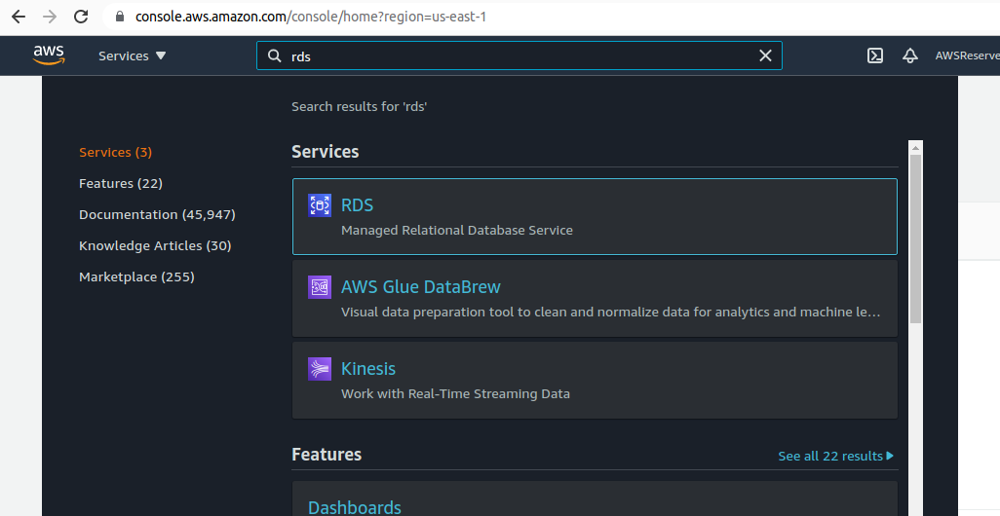
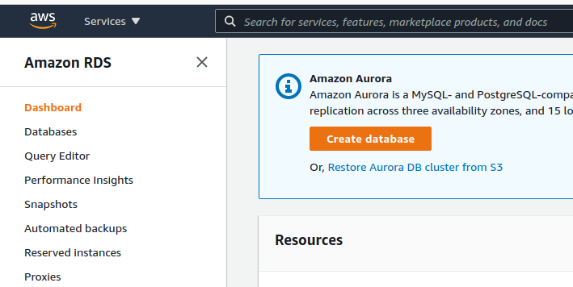
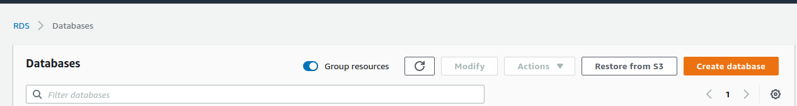
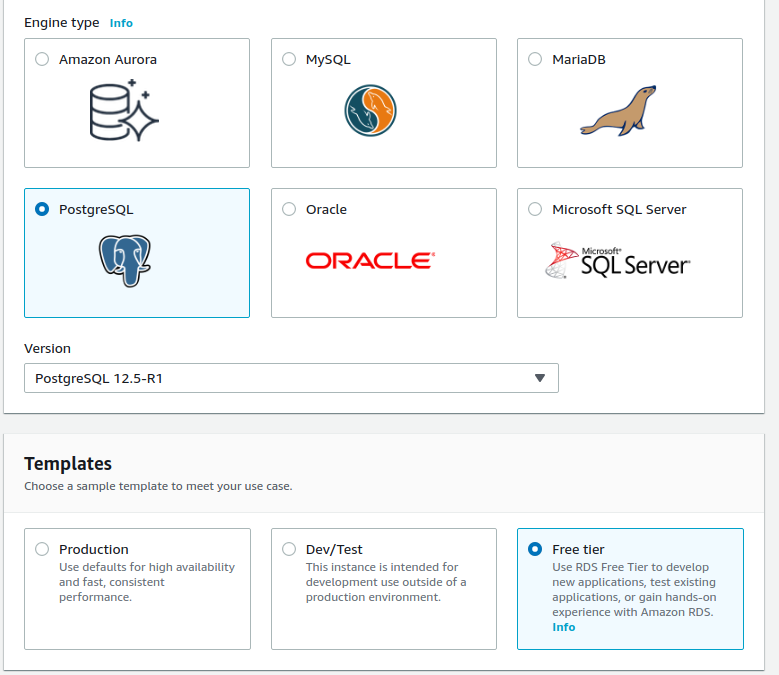
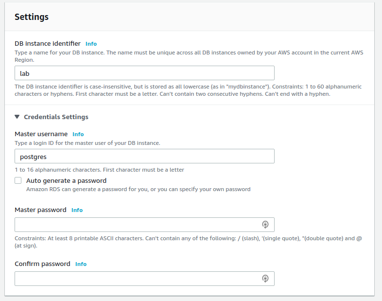
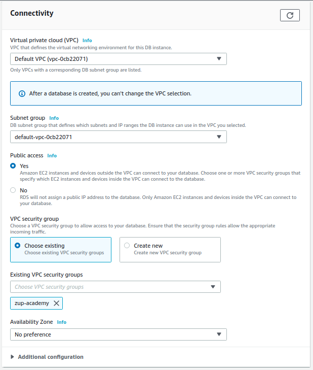
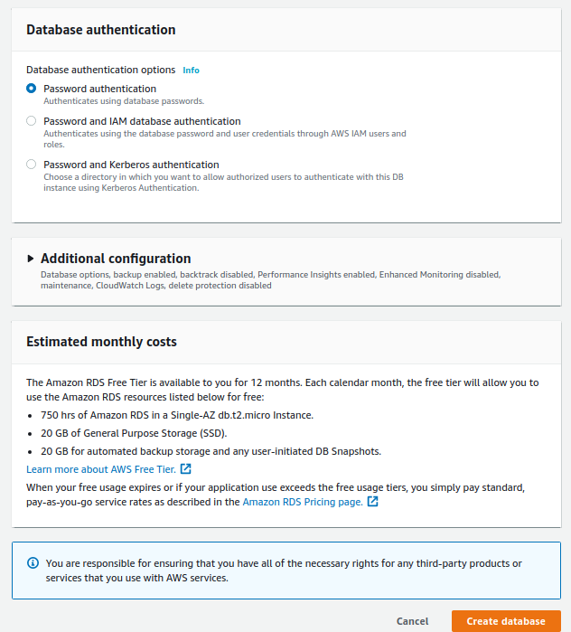
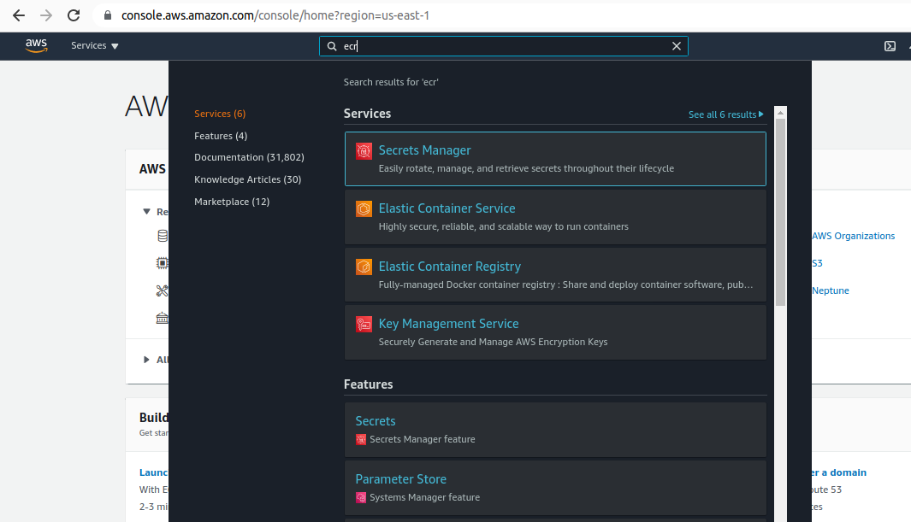
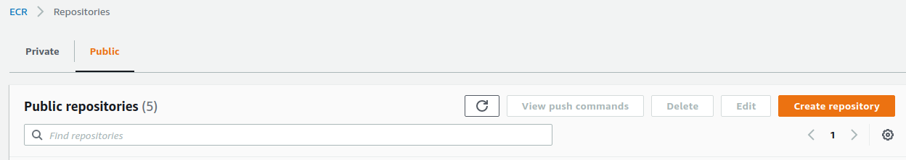

## Introdução

Docker é um conjunto de produtos de plataforma como serviço que usam virtualização de nível de sistema operacional para entregar software em pacotes chamados contêineres. Os contêineres são isolados uns dos outros e agrupam seus próprios softwares, bibliotecas e arquivos de configuração

## Projeto containerizando

1. gerar pacote containerizando no [start spring](https://start.spring.io/) com as dependências:

* jpa
* postgres
* web
* actuator

2. fazer o download do zip 

3. unzip pacote

```bash
unzip containerizando.zip
```

4. configurar application.properties para o postgres e para o actuator:

```xml
spring.jpa.database=POSTGRESQL
spring.datasource.platform=postgres
spring.database.driverClassName=org.postgresql.Driver
spring.datasource.username=postgres
spring.datasource.password=password
spring.datasource.url=jdbc:postgresql://localhost:5432/db
management.endpoints.health.sensitive=false
management.health.db.enabled=true
management.health.defaults.enabled=true
management.endpoint.health.show-details=always
```

5. configurar pom para actuator:

```xml
		<dependency>
			<groupId>org.springframework.boot</groupId>
				  <artifactId>spring-boot-starter-actuator</artifactId>
		  </dependency>
```

## Docker compose 

Ferramenta para definir e executar multiplos containers de forma declarativa, utilizando arquivos no formato yaml

6. Crie e execute este compose para subir o banco de dados, necessário para o corrreto startup de nossa aplicação:

docker-compose:

```yaml
version: '3'
services:

    postgres:
        image: 'postgres:alpine'
        volumes:
          - postgres-volume:/var/lib/postgresql/data
        ports:
          - 5432:5432
        environment:
          POSTGRES_USER: postgres
          POSTGRES_PASSWORD: password
          POSTGRES_DB: db
          POSTGRES_HOST: postgres    
volumes:
  postgres-volume:
```

start compose:

```bash
docker-compose up -d
```

7. build:

```bash
./mvnw package
```

O build foi feito com sucesso? Retornou algum erro de conexão com o banco de dados?

8. executando a app

```bash
mvn spring-boot:run
```

O start foi feito com sucesso? Retornou algum erro de conexão com o banco de dados?

Acesso em: http://localhost:8080/actuator/health

9. crie este Dockerfile para a aplicação:

```Dockerfile
FROM openjdk:11.0.7-jre-slim-buster

ARG JAR_FILE=target/*.jar
COPY ${JAR_FILE} application.jar
ENTRYPOINT ["java", "-jar", "/application.jar"]
```

10. build

```bash
docker image build -t rmnobarra/containerizando:latest .
```

11. executando o container:

```bash
docker container run -p 8080:8080 rmnobarra/containerizando --name containerizando
```

Verificar o status do serviço em http://localhost:8080/actuator/health

Por quê a conexão com o banco não está mais funcionando?

O contexto de conexão agora mudou, durante o desenvolvimento, o build / start da aplicação conectava no localhost da estação
que executava a ação, agora, dentro do container, o localhost não tem nenhum banco de dados aguardando conexão, logo é necessário
alterar a string de conexão, permitindo que o container da aplicação fale com o container do banco de dados

13. Alterar a string de conexão no application.properties, tornando-a flexivel tanto em desenvolvimento quanto em execução, utilizando
variáveis de ambiente

De:

```xml
spring.datasource.url=jdbc:postgresql://localhost:5432/db
```

para:

```xml
spring.datasource.url=${DATABASE_URL:jdbc:postgresql://localhost:5432/db}
```

14. Adicionar o containerizando no docker compose:

```Dockerfile
version: '3'
services:

    containerizando:
        container_name: containerizando
        image: rmnobarra/containerizando
        environment:
          DATABASE_URL: "jdbc:postgresql://postgres:5432/db"
        depends_on:
          - "postgres"
        ports:
          - 8080:8080    

    postgres:
        container_name: postgres
        image: 'postgres:alpine'
        volumes:
          - postgres-volume:/var/lib/postgresql/data
        ports:
          - 5432:5432
        environment:
          POSTGRES_USER: postgres
          POSTGRES_PASSWORD: password
          POSTGRES_DB: db
              
volumes:
 postgres-volume:
```

15. validar o compose com

docker-compose config

16. iniciar o container do containerizando:

```bash
docker-compose up -d 
```

Verifique novamente o status do serviço em http://localhost:8080/actuator/health

Por quê a conexão com o banco de dados ainda não funciona?

Não basta somente alterar a string de conexão, é necessário buildar a aplicação novamente, assim como gerar uma nova imagem docker.
Porque o build da imagem reflete o seu estado naquele momento, cada alteração na aplicação, demanda um novo build de imagem

```bash
./mvnw package
```

```bash
docker image build -t rmnobarra/containerizando:latest .
```

docker-compose down && docker-compose up

É possível iniciar ou derrubar determinado container dentro de um docker-compose utilizando o service name. Útil quando se tem diversos
serviços rodando no mesmo compose

E por quê funcionou agora?

Quando falamos de comunicação entre containers, basicamente temos 2 redes para conexão, a host network, que seria a rede aonde o serviço 
docker está sendo executado e temos a container network, que é uma rede dedicada para comunicação entre containers. É possivel
criar N redes para organizar a comunicação, quando nenhuma rede é criada, por padrão os containers são conectados a rede "_default"

Em cada container network o docker cria um serviço dns para facilitar a comunicação entre os containers, e com isso é possível a 
conexão entre containers utilizando o service name, veja a string de conexão da aplicação com o comando:

```bash
docker exec -ti containerizando env
```

Nenhum dado adicional além do service name do postgres foi utilizado e o actuator mostra que a conectividade entre aplicação e banco de dados
está ok. Verifique novamente em: http://localhost:8080/actuator/health

E como essa comunicação ocorre?

Basicamente temos 2 tipos de redes, a container network e host network. Quando falamos de conectividade entre containers,
a comunicação é feita diretamente via a container network.

Quando queremos acessar externamente determinado serviço que está sendo executado em um container, utilizamos a host network e um mapeamento
de portas (parâmetro -p)

Esse mapeamento nada mais é do que regras de firewall utilizando o módulo do kernel linux, netfilter

O netfilter é um módulo que fornece ao sistema operacional Linux as funções de firewall, NAT e log dos dados que trafegam por rede de computadores. Geralmente manipulamos as regras de firewall utilizando iptables ou nftables que são basicamente a interface amigável
para a gerencia das regras

Alguns comandos para listar as regras de firewall:

```bash
sudo iptables -S
```

```bash
sudo iptables -t nat -L
```

Veja o ip nas regras para o banco de dados (porta 5432) e para a aplicação (8080), redireciona automáticamente para os respectivos containers, veja seus ips:

Aplicação:
```bash
docker inspect containerizando -f '{{range.NetworkSettings.Networks}}{{.IPAddress}}{{end}}'
```

Banco de dados:
```bash
docker inspect postgres -f '{{range.NetworkSettings.Networks}}{{.IPAddress}}{{end}}'
```

## Analizando a imagem utilizando o dive

O [dive](https://github.com/wagoodman/dive) é uma ferramenta para explorar uma imagem docker, conteúdo de camada e descobrir maneiras de reduzir o tamanho de sua imagem Docker / OCI. (open container iniciative)

Executando:

17. pull da imagem

```bash
docker pull wagoodman/dive
```

18. Modo interativo: 

```bash
docker run --rm -it \
    -v /var/run/docker.sock:/var/run/docker.sock \
    wagoodman/dive:latest rmnobarra/containerizando:latest
```

Passando o parâmetro --ci, não é retornado a ui interativa, lowestEfficiency=0.8 faz o teste falhar caso a eficiência da imagem
fique abaixo de 80% e o espaço desperdiçado for maior que 45%

19. Modo ci:

```bash
docker run --rm -it \
    -v /var/run/docker.sock:/var/run/docker.sock \
    wagoodman/dive:latest --ci rmnobarra/containerizando:latest \
    --lowestEfficiency=0.8 --highestUserWastedPercent=0.45
```

O objetivo dessa ferramenta é tornar as imagens Docker ou OCI mais eficientes, alguns aspectos para ter em mente durante a construção:


* Copy-on-write

Copy-on-write é uma estratégia de compartilhamento e cópia de arquivos para máxima eficiência. Se um arquivo ou diretório existir em uma camada inferior da imagem e outra camada (incluindo a camada gravável) precisar de acesso de leitura a ele, ele apenas usará o arquivo existente. Na primeira vez que outra camada precisa modificar o arquivo (ao construir a imagem ou ao executar o contêiner), o arquivo é copiado para essa camada e modificado. Isso minimiza a E / S e o tamanho de cada uma das camadas subsequentes.

Este Dockerfile é um ótimo exemplo de como não criar uma imagem:

```Dockerfile
# Start with Ubuntu Trusty
FROM  phusion/baseimage:0.10.0

# Use baseimage-docker's init system.
CMD   ["/sbin/my_init"]

RUN	apt-get update
RUN apt-get -y install wget
RUN apt-get -y install curl
RUN curl -sL https://deb.nodesource.com/setup_10.x | bash
RUN apt-get -y install nodejs git-core
RUN npm install pm2 -g --no-optional
RUN npm install yarn@1.9.4 -g

# Clean up APT when done.
RUN apt-get clean && rm -rf /var/lib/apt/lists/* /tmp/* /var/tmp/*

# Copy source files to container
COPY	. /var/www/node

# Change owner to non-root node user and set up permissions
RUN chmod -R 777 var/www/node /var/log/
RUN useradd -m node && mkdir /var/log/nodejs && chown -R node:node /var/www/node /var/log/

# Install all my packages and build
RUN	cd /var/www/node && /sbin/setuser node yarn install && /sbin/setuser node yarn build:tsoa

# Open local port 3000
EXPOSE	3030

# Run PM2 as a daemon managed by runit
RUN mkdir /etc/service/pm2 && chmod -R 777 /etc/service/pm2
ADD ./scripts/pm2.sh /etc/service/pm2/run
RUN chmod -R 777 /etc/service/pm2
```

* Multi-stage build: método de organizar um Dockerfile para minimizar o tamanho do contêiner final, melhorar o desempenho do tempo de execução, permitir uma melhor organização de comandos e arquivos do Docker e fornecer um método padronizado de execução de ações de compilação

Dockerfile após ajustes:

```Dockerfile
# Start with Ubuntu Trusty
FROM  phusion/baseimage:0.10.0 AS BuildImage

# Use baseimage-docker's init system.
CMD   ["/sbin/my_init"]

RUN	apt-get update && apt-get install -y \
    wget \
    curl \
    && curl -sL https://deb.nodesource.com/setup_10.x | bash \
    && apt-get install -y \
    nodejs \
    git-core \
    && npm install yarn@1.9.4 -g

# Clean up APT when done.
RUN apt-get clean \
    && rm -rf /var/lib/apt/lists/* /tmp/* /var/tmp/*

# Copy source files to container
COPY	. /var/www/node

# Install all my packages and build
RUN	cd /var/www/node \
    && yarn install \
    && yarn build:tsoa \
    && yarn cache clean

FROM  phusion/baseimage:0.10.0 as RunImage

# Use baseimage-docker's init system.
CMD   ["/sbin/my_init"]

RUN curl -sL https://deb.nodesource.com/setup_10.x | bash \
    && apt-get update && apt-get install -y nodejs \
    && npm install pm2 -g --no-optional

COPY --from=BuildImage /var/www/node /var/www/node

# Clean up APT when done.
RUN apt-get clean \
    && rm -rf /var/lib/apt/lists/* /tmp/* /var/tmp/*

# Change owner to non-root node user and set up permissions
RUN chmod -R 777 var/www/node /var/log/ \
    && useradd -m node \
    && mkdir /var/log/nodejs \
    && chown -R node:node /var/www/node /var/log/

# Open local port 3000
EXPOSE	3030

# Run PM2 as a daemon managed by runit
RUN mkdir /etc/service/pm2 \
    && chmod -R 777 /etc/service/pm2
ADD ./scripts/pm2.sh /etc/service/pm2/run
RUN chmod -R 777 /etc/service/pm2
```

## Docker push

Com uma imagem eficiente e executando a aplicação corretamente, o próximo passo lógico e disponibiliza-la para execução além da estação
de trabalho na qual ela foi gerada, para isso hospedamos essa imagem no que chamamos de container registry.

Existe N containers registries na internet, privados ou públicos. Um dos mais populares é o docker hub.


20. docker login:

```bash
docker login
```

Este processo armazena as crendeciais dentro do .docker no home do usuario que executou o comando.

21. docker push
```bash
docker push rmnobarra/containerizando
```

Agora a imagem com a aplicação está disponivel para qualquer um que tenha acesso a internet.

## Evoluindo para deploy no aws eks

Temos a estrutura do helm pronta, porém algumas perguntas premissas precisam ser atendidas.

* A aplicação precisa de um banco de dados postgres para funcionar

* A aplicação recebe os valores do banco de dados nas variáveis DATABASE_USER, DATABASE_PASS e DATABASE_URL

* Precisa gerar o artefato container e envia-lo para um repositório público no aws ecr

* Precisa deployar a aplicação em um cluster eks

* Precisa utilizar um ou mais serviços aws developer tools para executar essas atividades

## Database

22. No campo de busca na console de gerenciamento na aws, digite "rds".



23. Na coluna no lado esquerdo, clique em Databases




24. Clique em Create Database



25. Em engine type, selecione postgres, version 12.5-R1, templates "Free tier"



26. Em settings, defina um nome para o banco de dados e uma senha (forte) para ele.



27. DB instance class, Storage e availability & durability, deixe como o padrão


28. Em Connectivity, selecione sua vpc e sub rede, habilite o "Public Access" e selecione um Security Group



29. Deixe os demais itens como default e clique em Create Database



*Este processo pode demorar um pouco*

Clique na database criada e anote o endereço do endpoint

Acesse o banco

psql --host <endpoint> -U postgres -d postgres -p 5432

crie a database

create database mydb;

crie o usuario

create user myuser with encrypted password 'mypass';

defina permissão do user para a databse

create user myuser with encrypted password 'mypass';

## ECR

30. No campo de busca na console de gerenciamento na aws, digite "ecr". Clique em Elastic Container Registry



31. Clique na aba "Public" e em create repository



32. Em Detail, defina um nome para o registry. As demais opções deixe como padrão.


## build e deploy

## eks

Para o codebuild interagir com o cluster eks, é preciso criar uma iam role

TRUST="{ \"Version\": \"2012-10-17\", \"Statement\": [ { \"Effect\": \"Allow\", \"Principal\": { \"AWS\": \"arn:aws:iam::208471844409:root\" }, \"Action\": \"sts:AssumeRole\" } ] }"

echo '{ "Version": "2012-10-17", "Statement": [ { "Effect": "Allow", "Action": "eks:Describe*", "Resource": "*" } ] }' > /tmp/iam-role-policy

aws iam create-role --role-name CodeBuildKubectlRole --assume-role-policy-document "$TRUST" --output text --query 'Role.Arn'

aws iam put-role-policy --role-name CodeBuildKubectlRole --policy-name eks-describe --policy-document file:///tmp/iam-role-policy

modificando aws-auth configmap

ROLE="    - rolearn: arn:aws:iam::208471844409:role/CodeBuildKubectlRole\n      username: build\n      groups:\n        - system:masters"

kubectl get -n kube-system configmap/aws-auth -o yaml | awk "/mapRoles: \|/{print;print \"$ROLE\";next}1" > /tmp/aws-auth-patch.yml

kubectl patch configmap/aws-auth -n kube-system --patch "$(cat /tmp/aws-auth-patch.yml)"


## codebuild

Crie o arquivo buildspec.yaml

```bash
touch pipeline/containerizando/buildspec.yaml
```

Adicione o conteúdo

```yaml
version: 0.2

phases:
  install:
    commands:
      - curl -o /bin/kubectl https://storage.googleapis.com/kubernetes-release/release/v1.16.0/bin/linux/amd64/kubectl
      - curl -sS -o aws-iam-authenticator https://amazon-eks.s3-us-west-2.amazonaws.com/1.10.3/2018-07-26/bin/linux/amd64/aws-iam-authenticator
      - wget -qO- https://get.helm.sh/helm-v3.5.2-linux-amd64.tar.gz | tar xvz
      - mv linux-amd64/helm /bin/helm
      - chmod +x /bin/kubectl /bin/helm ./aws-iam-authenticator
      - export PATH=$PWD/:$PATH
      - apt-get update && apt-get -y install jq python3-pip python3-dev && pip3 install --upgrade awscli
      
  build:
    commands:
      - docker login --username $DOCKERHUB_USERNAME --password $DOCKERHUB_PASSWORD
      - ./mvnw package
      - docker build -t lab .
      - docker image ls
      - docker tag lab public.ecr.aws/i2c7a5l2/lab:latest
      - docker image ls

  post_build:
    commands:
      - docker login -u AWS -p $(aws ecr-public get-login-password --region us-east-1) public.ecr.aws/i2c7a5l2/lab
      - docker push public.ecr.aws/i2c7a5l2/lab:latest
      - helm lint pipeline/containerizando --values pipeline/containerizando/values.yaml
      - aws eks update-kubeconfig --name zup-sandbox-edu-lab --role-arn arn:aws:iam::208471844409:role/CodeBuildKubectlRole
      - helm upgrade -i containerizando pipeline/containerizando/ --values pipeline/containerizando/values.yaml
```

## helm
Estrutura para deployment

```bash
mdkir pipeline
```

23. Cria helm
```bash
helm create pipeline/containerizando
```

24. Cria configmap.yaml
touch pipeline/containerizando/templates/configmap.yaml

25. Adicione o conteúdo

```yaml
kind: ConfigMap
apiVersion: v1
metadata:
  name: containerizando-cm
data:
  DATABASE_USER: "{{ .Values.application.DATABASE_USER }}"
  DATABASE_URL: "{{ .Values.application.DATABASE_URL }}"
```

26. Cria secrets.yaml

```bash
touch pipeline/containerizando/templates/secrets.yaml
```

27. Adicione o conteúdo
```yaml
---
apiVersion: v1
kind: Secret
metadata:
  name: containerizando-secrets
type: Opaque
data:
  DATABASE_PASS: {{ .Values.application.DATABASE_PASS | b64enc | quote  }}
```

28. Em pipeline/containerizando/values.yaml adicione no final do arquivo

```yaml
application:
  DATABASE_USER: myuser
  DATABASE_URL: jdbc:postgresql://lab.chpeyn5uxxax.us-east-1.rds.amazonaws.com:5432/mydb
  DATABASE_PASS: mypass
```

Ainda no values, altere "image" para public.ecr.aws/i2c7a5l2/lab/containerizando
e a tag para "latest"

No arquivo deployment em containers

```yaml
          envFrom:
            - configMapRef:
                name: containerizando-cm
            - secretRef:
                name: containerizando-secrets
```
e altere a container port para 8080

e em services altere a targetPort para 8080

## Role para o codebuild

Crie uma role com as policies

CloudWatchFullAccess
AmazonElasticContainerRegistryPublicPowerUser

inline readonly eks

{
    "Version": "2012-10-17",
    "Statement": [
        {
            "Sid": "EKSREADONLY",
            "Effect": "Allow",
            "Action": [
                "eks:DescribeNodegroup",
                "eks:DescribeUpdate",
                "eks:DescribeCluster"
            ],
            "Resource": "*"
        },
        {
            "Sid": "STSASSUME",
            "Effect": "Allow",
            "Action": "sts:AssumeRole",
            "Resource": "arn:aws:iam::44755xxxxxxx:role/EksCodeBuildkubectlRole"
        }
    ]
}

## Codebuild

kubectl expose deployment/containerizando --type LoadBalancer

k port-forward <pod> 8080:80
## Finalizando

Adicione o repo https://github.com/rmnobarra/containerizando.git como source, branche k8s, marque a caixa
"Privileged" Enable this flag if you want to build Docker images or want your builds to get elevated privileges


Em environment, selecione Ubuntu, runtime Standard e image 5.0
Para saber mais:

[Docker para desenvolvedores](https://leanpub.com/dockerparadesenvolvedores)

[Canal no telegram sobre docker](https://t.me/dockerbr)

[Volumes](https://docs.docker.com/storage/)

[Open container iniciative](https://www.padok.fr/en/blog/container-docker-oci)

[Open container iniciative 2](https://www.docker.com/blog/demystifying-open-container-initiative-oci-specifications/)

[Spring boot actuator](https://www.onlinetutorialspoint.com/spring-boot/spring-boot-actuator-database-health-check.html)

[Copy on write](https://docs.docker.com/storage/storagedriver/)

[Multi Stage build](https://docs.docker.com/develop/develop-images/multistage-build/)

[Melhores praticas para Dockerfile](https://docs.docker.com/develop/develop-images/dockerfile_best-practices/)

[Criando role para interagir com o eks](https://www.eksworkshop.com/intermediate/220_codepipeline/role/)
---
